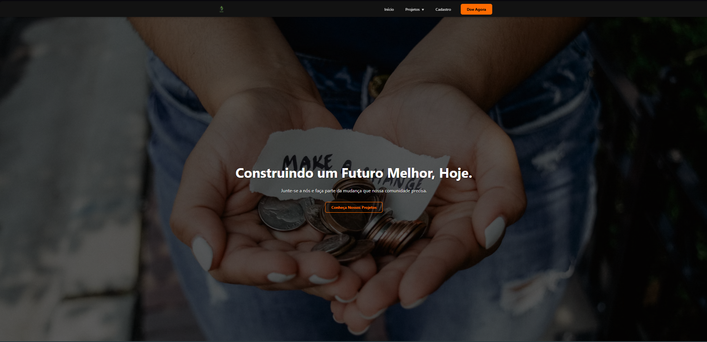

# Futuro Melhor - Plataforma para ONGs (Frontend SPA)

-brightgreen)

Projeto frontend completo para uma plataforma web de uma ONG fictícia ("Futuro Melhor"), desenvolvido como parte de um trabalho acadêmico. O projeto evoluiu de um site estático para uma **Single Page Application (SPA)** dinâmica, interativa, acessível (WCAG 2.1 AA) e otimizada, construída com JavaScript puro (ES6+ Módulos), HTML5 semântico e CSS3 moderno.

---

### 🖼️ Prévia do Projeto





---

## ✨ Arquitetura e Funcionalidades Implementadas

### Arquitetura SPA (Single Page Application)
-   **Roteamento via Hash:** Navegação fluida entre seções (`#/`, `#/projetos`, `#/cadastro`, `#/doacao`) sem recarregar a página.
-   **Renderização Dinâmica:** Conteúdo principal carregado dinamicamente via JavaScript no elemento `<main>`.
-   **JavaScript Modular:** Código organizado em módulos (`app.js`, `router.js`, `templates.js`, `data.js`, `formValidator.js`, `projectModal.js`, `donationForm.js`, `nav.js`, `modal.js`) utilizando `import`/`export`.

### Páginas e Templates Dinâmicos
-   **Início (`#/`):** Apresentação da ONG, missão e chamada para voluntariado.
-   **Projetos (`#/projetos`):** Galeria de projetos em cards responsivos com tags de categoria.
-   **Cadastro (`#/cadastro`):** Formulário completo para novos membros/voluntários.
-   **Doação (`#/doacao`):** Formulário dedicado para doações com simulação de pagamento.

### Componentes Interativos e Acessíveis
-   **Navegação Responsiva (WCAG):**
    -   Cabeçalho fixo com menu dropdown no desktop e menu hambúrguer funcional no mobile.
    -   Totalmente navegável via teclado (`:focus-visible`, ordem lógica).
    -   Atributos ARIA (`role`, `aria-label`, `aria-expanded`, `aria-controls`, `aria-hidden`) para suporte a leitores de tela.
    -   Menu mobile pode ser fechado com a tecla `Escape`.
-   **Modal de Detalhes do Projeto (WCAG):**
    -   Abre via botão "Saiba Mais" ou link direto do dropdown (ex: `/#/projetos?open=educacao`).
    -   Conteúdo carregado dinamicamente (`data.js`).
    -   Acessível via teclado ("focus trap" para prender o Tab dentro do modal).
    -   Fecha com `Escape`, botão "Fechar" ou clique no overlay.
    -   Atributos ARIA (`role="dialog"`, `aria-modal`, `aria-labelledby`) implementados.
-   **Modal de Feedback (WCAG):**
    -   Exibido após envio bem-sucedido dos formulários.
    -   Também acessível via teclado e fecha com `Escape`.
-   **Formulários Avançados (WCAG):**
    -   **Validação de Consistência (JS):** Validação em tempo real (nome sem números, CPF válido, e-mail, etc.) com mensagens de erro claras e feedback visual (verde/vermelho) controlado por JS.
    -   **Máscaras de Input (IMask.js):** Para CPF, telefone, CEP, cartão, validade, CVV.
    -   Labels associadas corretamente aos inputs.
-   **Efeito de Confetes:** Feedback visual com `canvas-confetti` no envio do formulário de doação.
-   **Badges/Tags:** Para categorização visual nos cards de projeto.
-   **Botões:** Com todos os estados (`:hover`, `:focus`, `:active`, `[disabled]`) e contraste de cor corrigido (AA).

### Otimização e Boas Práticas
-   **Minificação:** Arquivos CSS e JavaScript minificados para reduzir o tamanho.
-   **Compressão de Imagens:** Imagens otimizadas para carregamento mais rápido.
-   **Controle de Versão (GitFlow):** Uso de branches (`main`, `develop`, `feature/...`, `release/...`) e commits semânticos para organização do desenvolvimento.
-   **Versionamento Semântico:** Criação de tag `v1.0.0` para marcar a primeira release estável.

---

## 🚀 Tecnologias Utilizadas

-   **HTML5:** Estrutura semântica (com roles ARIA).
-   **CSS3:** Estilização, Design System (Variáveis CSS), Grid Layout (12 colunas), Flexbox, Media Queries (5 breakpoints), Animações básicas.
-   **JavaScript (ES6+ Módulos):** Manipulação do DOM (SPA), Gerenciamento de Eventos (Delegação), Roteamento (hash), Templates (template literals), Validação Avançada, Acessibilidade (foco, ARIA).
-   **Bibliotecas Externas:**
    -   **[IMask.js](https://imask.js.org/):** Máscaras de input.
    -   **[canvas-confetti](https://github.com/catdad/canvas-confetti):** Efeito de confetes.
-   **Ferramentas (Manuais):** Minificadores online (CSS/JS), Compressores de imagem online.
-   **Controle de Versão:** Git, GitHub (com GitFlow).

---

## ✅ Requisitos Acadêmicos Atendidos (Entregas I, II, III, IV)

-   [x] **Estrutura HTML5 Semântica:** Adaptada para SPA e WCAG.
-   [x] **Formulários Complexos:** Com validação nativa, JS (consistência) e máscaras.
-   [x] **Código Fonte Organizado:** Estrutura de pastas modular.
-   [x] **Sistema de Design CSS:** Completo e baseado em variáveis.
-   [x] **Leiautes Responsivos:** Grid, Flexbox, 5 breakpoints.
-   [x] **Navegação Sofisticada:** Dropdown, Hambúrguer, acessível via teclado.
-   [x] **Componentes de Interface:** Cards, Botões (estados), Validação Visual (JS), Modais (feedback, detalhes), Badges/Tags.
-   [x] **SPA Básica:** Roteamento via hash, templates JS, renderização dinâmica.
-   [x] **Validação de Consistência:** Lógica JS para CPF, nome, etc., com mensagens.
-   [x] **Código JS Modular:** Múltiplos arquivos com `import`/`export`.
-   [x] **Controle de Versão:** GitFlow, commits semânticos, tag de release (`v1.0.0`).
-   [x] **Acessibilidade (WCAG 2.1 AA):** Contraste, navegação por teclado, semântica/ARIA, focus management.
-   [x] **Otimização:** Minificação de CSS/JS, compressão de imagens.
-   [x] **Documentação:** README profissional.

---

## 🏁 Como Executar o Projeto

1.  Clone o repositório:
    ```bash
    git clone [https://github.com/esthevamnascimento/futuromelhor.git](https://github.com/esthevamnascimento/futuromelhor.git) 
    ```
2.  Navegue até a pasta do projeto:
    ```bash
    cd futuromelhor
    ```
3.  Abra o arquivo `index.html` no seu navegador.
    * **⚠️ IMPORTANTE:** Devido ao uso de Módulos JavaScript (`type="module"`), o projeto pode não funcionar corretamente se aberto diretamente do sistema de arquivos (`file:///`). **É altamente recomendado usar um servidor local.** Uma maneira fácil é usar a extensão **"Live Server"** no Visual Studio Code (clique com o botão direito no `index.html` e escolha "Open with Live Server").

---

## 👨‍💻 Autor

Desenvolvido por **Esthevam Nascimento**.